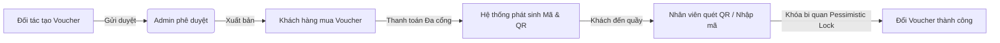
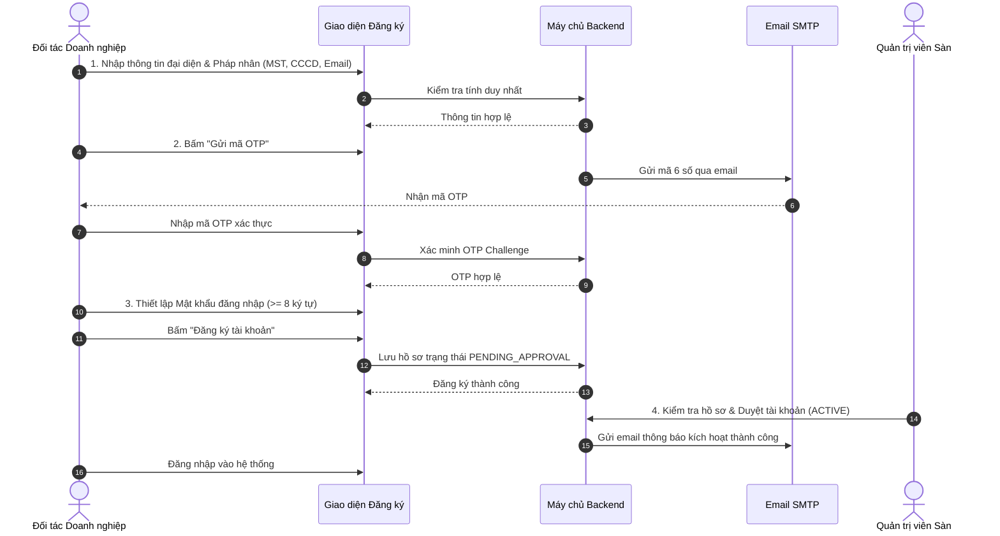
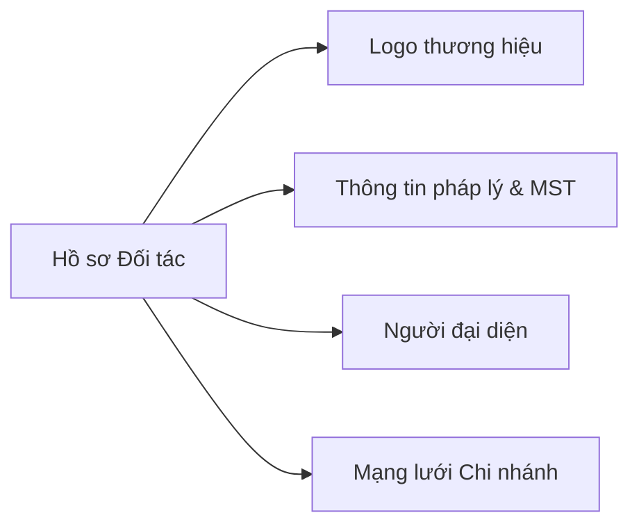
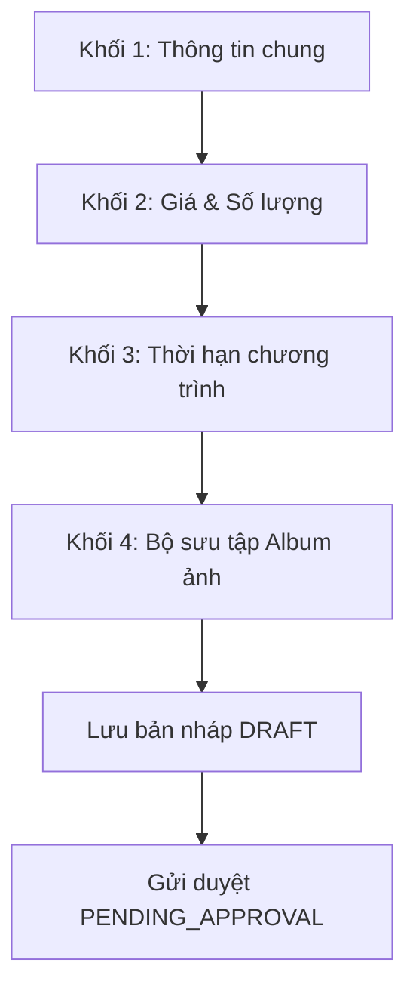
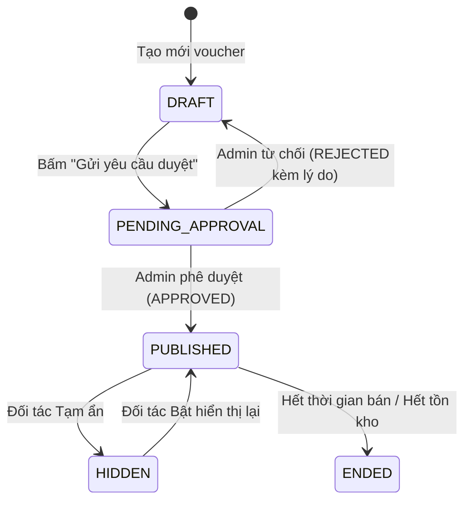
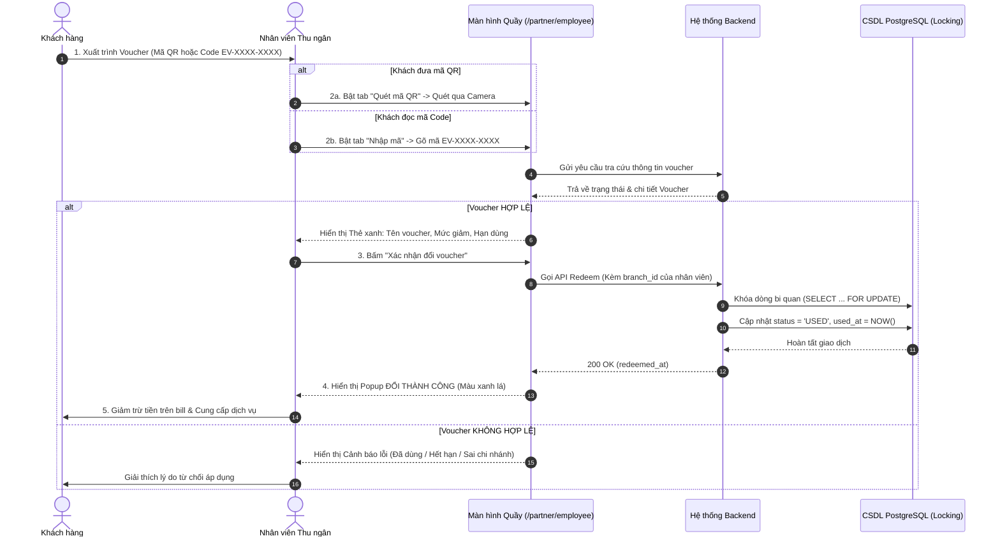

# HƯỚNG DẪN SỬ DỤNG HỆ THỐNG E-VOUCHER
## DÀNH CHO ĐỐI TÁC DOANH NGHIỆP VÀ NHÂN VIÊN ĐỐI TÁC

---

## MỤC LỤC
1. [PHẦN I: TỔNG QUAN HỆ THỐNG VÀ QUY ĐỊNH CHUNG](#phần-i-tổng-quan-hệ-thống-và-quy-định-chung)
   - [1.1 Giới thiệu Hệ thống E-Voucher](#11-giới-thiệu-hệ-thống-e-voucher)
   - [1.2 Phân định Vai trò và Ma trận Phân quyền](#12-phân-định-vai-trò-và-ma-trận-phân-quyền)
   - [1.3 Yêu cầu Kỹ thuật và Môi trường Sử dụng](#13-yêu-cầu-kỹ-thuật-và-môi-trường-sử-dụng)
2. [PHẦN II: HƯỚNG DẪN DÀNH CHO ĐỐI TÁC (PARTNER / MERCHANT)](#phần-ii-hướng-dẫn-dành-cho-đối-tác-partner--merchant)
   - [Chương 1: Đăng ký Tài khoản và Thiết lập Ban đầu](#chương-1-đăng-ký-tài-khoản-và-thiết-lập-ban-đầu)
   - [Chương 2: Bảng Điều khiển Tổng quan (Dashboard)](#chương-2-bảng-điều-khiển-tổng-quan-dashboard)
   - [Chương 3: Quản lý Hồ sơ Doanh nghiệp và Mạng lưới Chi nhánh](#chương-3-quản-lý-hồ-sơ-doanh-nghiệp-và-mạng-lưới-chi-nhánh)
   - [Chương 4: Quản lý Nhân sự Chi nhánh](#chương-4-quản-lý-nhân-sự-chi-nhánh)
   - [Chương 5: Tạo mới và Quản lý Chiến dịch Voucher](#chương-5-tạo-mới-và-quản-lý-chiến-dịch-voucher)
   - [Chương 6: Tra cứu và Khấu trừ Voucher tại Quầy](#chương-6-tra-cứu-và-khấu-trừ-voucher-tại-quầy)
   - [Chương 7: Báo cáo Thống kê và Phân tích Hiệu quả Kinh doanh](#chương-7-báo-cáo-thống-kê-và-phân-tích-hiệu-quả-kinh-doanh)
3. [PHẦN III: HƯỚNG DẪN DÀNH CHO NHÂN VIÊN ĐỐI TÁC (PARTNER EMPLOYEE)](#phần-iii-hướng-dẫn-dành-cho-nhân-viên-đối-tác-partner-employee)
   - [Chương 1: Tiếp nhận Tài khoản và Đăng nhập Cổng Quầy Thu ngân](#chương-1-tiếp-nhận-tài-khoản-và-đăng-nhập-cổng-quầy-thu-ngân)
   - [Chương 2: Quy trình Kiểm tra và Đổi Voucher tại Điểm bán (Redeem Flow)](#chương-2-quy-trình-kiểm-tra-và-đổi-voucher-tại-điểm-bán-redeem-flow)
   - [Chương 3: Quản lý Hồ sơ Cá nhân và Đổi Mật khẩu](#chương-3-quản-lý-hồ-sơ-cá-nhân-và-đổi-mật-khẩu)
4. [PHẦN IV: BẢNG XỬ LÝ SỰ CỐ VÀ CÂU HỎI THƯỜNG GẶP (FAQS)](#phần-iv-bảng-xử-lý-sự-cố-và-câu-hỏi-thường-gặp-faqs)

---

# PHẦN I: TỔNG QUAN HỆ THỐNG VÀ QUY ĐỊNH CHUNG

## 1.1 Giới thiệu Hệ thống E-Voucher
Hệ thống **E-Voucher System** là nền tảng thương mại điện tử đồng bộ hóa quy trình phát hành, phân phối và sử dụng voucher khuyến mãi điện tử giữa:
- **Khách hàng (`CUSTOMER`)**: Mua voucher, nhận mã điện tử/QR vector và sử dụng tại điểm bán.
- **Đối tác Doanh nghiệp (`PARTNER`)**: Đăng ký gian hàng, quản lý mạng lưới chi nhánh, tạo chiến dịch ưu đãi, tải lên album ảnh lưu trữ đám mây (AWS S3/Cloudflare R2), quản lý nhân viên và giám sát doanh thu.
- **Nhân viên Đối tác (`PARTNER_EMPLOYEE`)**: Thu ngân tại từng chi nhánh, trực tiếp dùng thiết bị quét mã QR hoặc nhập mã code để kiểm tra và khấu trừ voucher của khách.
- **Quản trị viên Sàn (`ADMIN`)**: Kiểm duyệt hồ sơ doanh nghiệp, phê duyệt nhân sự chi nhánh, duyệt phát hành voucher, quản trị đơn hàng và vận hành hệ thống.



## 1.2 Phân định Vai trò và Ma trận Phân quyền

| Nhóm chức năng | Đối tác (`PARTNER`) | Nhân viên Đối tác (`PARTNER_EMPLOYEE`) | Ghi chú nghiệp vụ |
| :--- | :---: | :---: | :--- |
| **Đăng ký tài khoản doanh nghiệp** | Có | ❌ Không | Đối tác tự đăng ký và xác thực OTP email |
| **Quản lý Hồ sơ & Logo thương hiệu** | Có | ❌ Không | Lưu trữ hình ảnh trên Cloudflare R2 / S3 |
| **Quản lý Danh sách Chi nhánh** | Có | ❌ Không | Thêm, sửa, xóa mềm chi nhánh |
| **Tạo tài khoản Nhân viên chi nhánh** | Có | ❌ Không | Tài khoản cần Admin sàn phê duyệt để kích hoạt |
| **Tạo mới & Biên tập Voucher** | Có | ❌ Không | Chỉ sửa khi ở trạng thái `DRAFT` hoặc bị `REJECTED` |
| **Gửi duyệt Voucher lên sàn** | Có | ❌ Không | Admin sàn kiểm duyệt nội dung và chính sách giá |
| **Ẩn / Hiện Voucher đang bán** | Có | ❌ Không | Điều chỉnh trạng thái hiển thị `ACTIVE` / `HIDDEN` |
| **Tra cứu Voucher (Nhập mã / Quét QR)** | Có | Có | Đối tác tra cứu toàn hệ thống; Nhân viên theo chi nhánh |
| **Khấu trừ Voucher tại quầy (Redeem)** | Có | Có | Nhân viên chỉ đổi được voucher áp dụng tại chi nhánh mình |
| **Xem Báo cáo Doanh thu & Thống kê** | Có | ❌ Không | Xem KPI, tỷ lệ quy đổi (`Usage Rate`) |
| **Quản lý Hồ sơ cá nhân & Đổi mật khẩu** | Có | Có | Thao tác trên cổng cá nhân tương ứng |

## 1.3 Yêu cầu Kỹ thuật và Môi trường Sử dụng
- **Thiết bị sử dụng**:
  - *Đối tác quản trị*: Máy tính để bàn (PC) hoặc Laptop có màn hình tối thiểu từ 1280x720 trở lên để có trải nghiệm quản lý bảng biểu tốt nhất.
  - *Nhân viên thu ngân tại quầy*: Máy tính bàn, Tablet (iPad/Android) hoặc Điện thoại thông minh có Camera kết nối Internet.
- **Trình duyệt khuyến nghị**: Google Chrome (phiên bản 100+), Apple Safari, Mozilla Firefox, Microsoft Edge.
- **Quyền truy cập Camera**: Để sử dụng tính năng quét mã QR qua Camera, thiết bị cần được cấp quyền `Cho phép truy cập Máy ảnh (Camera Permission)` trong hộp thoại thông báo của trình duyệt.
- **Bảo mật kết nối**: Hệ thống vận hành trên nền tảng web bảo mật chuẩn HTTPS với chứng chỉ SSL/TLS.

---

# PHẦN II: HƯỚNG DẪN DÀNH CHO ĐỐI TÁC (PARTNER / MERCHANT)

## Chương 1: Đăng ký Tài khoản và Thiết lập Ban đầu

Quy trình đăng ký tài khoản Đối tác được thiết kế qua **4 bước tuần tự** bảo mật nghiêm ngặt nhằm xác minh tính pháp lý của doanh nghiệp:



### Hướng dẫn chi tiết từng bước:

#### **Bước 1: Khai báo Thông tin Định danh & Doanh nghiệp**
1. Truy cập trang đăng ký đối tác tại địa chỉ: `/partner/register`.
2. Điền đầy đủ và chính xác các trường thông tin:
   - **Họ và tên người đại diện**: Tên đầy đủ trên giấy tờ pháp lý (ví dụ: *Nguyễn Văn An*).
   - **Số CCCD / CMND**: Số căn cước công dân của người đại diện (9 hoặc 12 chữ số).
   - **Số điện thoại liên hệ**: Số điện thoại di động chính thức.
   - **Email doanh nghiệp**: Email dùng để nhận mã OTP và các thông báo vận hành quan trọng từ hệ thống.
   - **Tên doanh nghiệp / Thương hiệu**: Tên thương hiệu hiển thị với khách hàng (ví dụ: *Công ty TNHH Ẩm Thực Highlands*).
   - **Mã số thuế (MST)**: Mã số thuế doanh nghiệp (10 hoặc 13 ký tự).

> [!IMPORTANT]
> Mã số thuế, Số CCCD và Email phải là **duy nhất** trên toàn hệ thống. Nếu thông tin đã được đăng ký trước đó, hệ thống sẽ báo lỗi `409 Conflict` và yêu cầu kiểm tra lại.

#### **Bước 2: Xác thực OTP qua Email**
1. Nhấn nút **"Tiếp tục"** $\rightarrow$ Hệ thống gửi mã OTP 6 chữ số đến địa chỉ email đã đăng ký.
2. Kiểm tra hộp thư đến (hoặc thư mục Spam/Junk), lấy mã xác thực 6 số.
3. Nhập mã OTP vào 6 ô trên màn hình (Hệ thống có đồng hồ đếm ngược 60 giây. Nếu chưa nhận được mã, nhấn *Gửi lại mã* sau khi hết thời gian chờ).
4. Nhấn **"Xác thực"** để hoàn tất kiểm tra danh tính.

#### **Bước 3: Thiết lập Mật khẩu Đăng nhập**
1. Nhập **Mật khẩu mới**: Yêu cầu độ dài tối thiểu từ **8 ký tự trở lên** (nên bao gồm chữ hoa, chữ thường, chữ số và ký tự đặc biệt để đảm bảo an toàn).
2. Nhập lại mật khẩu vào ô **Xác nhận mật khẩu**.
3. Nhấn **"Hoàn tất đăng ký"**.

#### **Bước 4: Chờ Phê duyệt & Kích hoạt Tài khoản**
- Sau khi hoàn tất đăng ký, tài khoản của bạn sẽ ở trạng thái **Chờ duyệt (`PENDING_APPROVAL`)**.
- Quản trị viên sàn sẽ tiến hành đối soát thông tin pháp lý doanh nghiệp trong vòng 24h làm việc.
- Khi hồ sơ được phê duyệt, bạn sẽ nhận được **Email thông báo kích hoạt thành công (`APPROVED`)** và có thể đăng nhập vào hệ thống để bắt đầu vận hành.

---

## Chương 2: Bảng Điều khiển Tổng quan (Dashboard)

Sau khi đăng nhập tại `/login` hoặc `/partner`, Đối tác sẽ được chuyển đến trang Tổng quan (**Dashboard**):

```
+-----------------------------------------------------------------------------------+
|  [HIGH-LEVEL KPI SUMMARY]                                                         |
|  +--------------------+ +--------------------+ +--------------------+ +---------+ |
|  | Tổng số ch.trình   | | Đang chờ duyệt     | | Đã duyệt           | | Doanh   | |
|  |       12           | |        2           | |        8           | | 45.2M đ | |
|  +--------------------+ +--------------------+ +--------------------+ +---------+ |
+-----------------------------------------------------------------------------------+
|  VOUCHER GẦN ĐÂY                                           [Xem tất cả ->]        |
|  +------------------------+-------------+------------+-----------+--------------+ |
|  | Tên Voucher            | Danh mục    | Giá bán    | Đã bán    | Trạng thái   | |
|  | Combo Trà Sữa 2 Ly     | Ẩm thực     | 59.000 đ   | 142       | [Đang mở bán]| |
|  | Voucher Giảm 50K Spa   | Làm đẹp     | 20.000 đ   | 89        | [Chờ duyệt]  | |
|  +------------------------+-------------+------------+-----------+--------------+ |
+-----------------------------------------------------------------------------------+
```

### 1. Ý nghĩa 4 Thẻ chỉ số KPI chính:
- **Tổng số chương trình**: Tổng số lượng chiến dịch voucher bạn đã tạo trong toàn bộ lịch sử (bao gồm bản nháp, chờ duyệt, đang bán, tạm ẩn, đã kết thúc).
- **Đang chờ duyệt**: Số lượng chiến dịch voucher đang gửi lên Quản trị viên sàn và đang chờ thẩm định nội dung.
- **Đã duyệt**: Số lượng voucher hợp lệ đã được phê duyệt và sẵn sàng mở bán trên sàn.
- **Tổng doanh thu**: Tổng số tiền thực nhận từ toàn bộ các đơn hàng mua voucher thành công của khách hàng.

### 2. Danh sách Voucher gần đây:
- Hiển thị nhanh các chương trình mới tạo hoặc vừa cập nhật trạng thái.
- Nhấp vào từng dòng để mở trang chi tiết điều chỉnh hoặc bấm nút **"Xem tất cả"** để chuyển sang trang Quản lý Voucher đầy đủ.

---

## Chương 3: Quản lý Hồ sơ Doanh nghiệp và Mạng lưới Chi nhánh

Truy cập menu bên trái $\rightarrow$ **"Hồ sơ đối tác"** (`/partner/profile`). Trang gồm 5 tab quản lý chuyên biệt:



### 1. Cập nhật Logo Thương hiệu (Brand Logo)
- **Mục đích**: Logo đại diện sẽ hiển thị trên trang chủ sàn, trang chi tiết voucher và gian hàng đối tác.
- **Thao tác**:
  1. Chọn tab **"Logo thương hiệu"**.
  2. Kéo thả hoặc bấm chọn tệp ảnh từ máy tính (Định dạng hỗ trợ: `.png`, `.jpg`, `.jpeg`, `.webp`, dung lượng tối đa 5MB).
  3. Ảnh tự động tải lên máy chủ đám mây **Cloudflare R2 / AWS S3** và cập nhật giao diện ngay lập tức.

### 2. Cập nhật Thông tin Pháp lý & Người đại diện
- **Thông tin pháp lý**: Tên doanh nghiệp, Số giấy phép ĐKKD, Ngày cấp, Nơi cấp, Mã số thuế.
- **Người đại diện**: Họ tên, Số CCCD, Quốc tịch, Số điện thoại liên lạc.
- Sau khi chỉnh sửa, bấm nút **"Lưu thay đổi"** ở góc phải phía trên.

### 3. Quản lý Mạng lưới Chi nhánh Cửa hàng (Branches)

Chi nhánh là địa điểm thực tế nơi khách hàng mang voucher đến sử dụng dịch vụ.

#### A. Thêm Chi nhánh mới:
1. Chọn tab **"Danh sách chi nhánh"** $\rightarrow$ Bấm nút **"+ Thêm chi nhánh mới"**.
2. Nhập các thông tin bắt buộc trong hộp thoại Modal:
   - **Tên chi nhánh**: Ví dụ: *Highlands Coffee - Chi nhánh Nguyễn Huệ*.
   - **Khu vực**: Chọn Miền Bắc, Miền Trung hoặc Miền Nam.
   - **Địa chỉ chi tiết**: Số nhà, tên đường, phường/xã, quận/huyện, tỉnh/thành phố.
   - **Số điện thoại chi nhánh**: Số máy bàn hoặc hotline tại điểm bán.
   - **Trạng thái ban đầu**: Mặc định là `Đang hoạt động (active)`.
3. Bấm **"Lưu chi nhánh"** $\rightarrow$ Chi nhánh xuất hiện ngay trên danh sách.

#### B. Chỉnh sửa / Vô hiệu hóa Chi nhánh:
- **Chỉnh sửa**: Bấm vào biểu tượng cây bút (`Edit`) trên dòng chi nhánh tương ứng để cập nhật địa chỉ hoặc số điện thoại.
- **Vô hiệu hóa (Xóa mềm)**: Khi chi nhánh tạm ngừng hoạt động hoặc chuyển địa điểm, chỉnh sửa trạng thái sang `inactive` (Tạm ngưng). Các voucher hiện hành sẽ không cho phép nhân viên đổi tại chi nhánh này nữa.

---

## Chương 4: Quản lý Nhân sự Chi nhánh

Truy cập menu bên trái $\rightarrow$ **"Quản lý nhân viên"** (`/partner/employees`).

```
+-----------------------------------------------------------------------------------+
|  DANH SÁCH NHÂN VIÊN CHI NHÁNH                            [+ Thêm nhân viên mới]  |
|  [🔍 Tìm theo tên, email, SĐT...]  [Lọc theo Chi nhánh: Tất cả chi nhánh v]        |
|  +-------------------+-----------------------------+-----------------+------------+ |
|  | Nhân viên         | Chi nhánh phân công         | Trạng thái      | Thao tác   | |
|  | Trần Minh Tâm     | Highlands Coffee Nguyễn Huệ | [Đang hoạt động]| [Sửa] [Xóa]| |
|  | Lê Hoàng Yến      | Highlands Coffee Cầu Giấy   | [Chờ duyệt]     | [Chi tiết] | |
|  +-------------------+-----------------------------+-----------------+------------+ |
+-----------------------------------------------------------------------------------+
```

### 1. Thêm mới Tài khoản Nhân viên Thu ngân:
1. Bấm nút **"+ Thêm nhân viên mới"** để mở Modal tạo nhân sự.
2. Điền đầy đủ thông tin:
   - **Họ và tên**: Tên nhân viên thu ngân.
   - **Email đăng nhập**: Email cá nhân hoặc email nội bộ của nhân viên (duy nhất).
   - **Số điện thoại**: Số điện thoại liên hệ.
   - **Số CCCD / CMND**: Số định danh cá nhân.
   - **Giới tính & Quốc tịch**: Chọn Nam/Nữ/Khác, Quốc tịch.
   - **Chi nhánh làm việc**: Chọn từ danh sách các chi nhánh `active` của đối tác.
   - **Mật khẩu ban đầu**: Nhập mật khẩu khởi tạo (tối thiểu **8 ký tự**) và cấp lại cho nhân viên.
3. Bấm **"Tạo tài khoản"**.

> [!IMPORTANT]
> **Quy tắc Kiểm duyệt Nhân sự của Hệ thống**:
> Để bảo vệ dữ liệu tài chính và chống gian lận khấu trừ voucher tại điểm bán, tài khoản nhân viên mới tạo sẽ ở trạng thái **Chờ Admin duyệt (`PENDING_APPROVAL`)**. Sau khi Quản trị viên sàn phê duyệt, tài khoản sẽ chuyển sang `ACTIVE` và nhân viên mới có thể đăng nhập thực hiện đổi voucher.

### 2. Tìm kiếm, Lọc và Điều chuyển Chi nhánh:
- **Tìm kiếm**: Gõ tên, email hoặc SĐT vào thanh tìm kiếm để lọc nhanh.
- **Lọc theo chi nhánh**: Chọn chi nhánh cụ thể từ menu dropdown.
- **Điều chuyển chi nhánh**: Khi nhân viên chuyển sang làm việc tại chi nhánh khác, Đối tác mở chi tiết nhân viên và cập nhật lại trường *Chi nhánh phân công*.

---

## Chương 5: Tạo mới và Quản lý Chiến dịch Voucher

### 5.1 Quy trình Tạo mới Chương trình Voucher (`/partner/vouchers/create`)
Form tạo voucher được chia thành **4 khối trường dữ liệu** rõ ràng:



#### **Khối 1: Thông tin chung (General Information)**
- **Tên chương trình voucher**: Tên ưu đãi hấp dẫn, rõ ràng (ví dụ: *Voucher Giảm 50% Toàn Menu Trà Sữa Size L*).
- **Danh mục ngành hàng**: Chọn ngành hàng phù hợp (Ẩm thực, Giải trí, Mua sắm, Làm đẹp, Du lịch, v.v.).
- **Chi nhánh áp dụng**: Tích chọn một hoặc nhiều chi nhánh được phép chấp nhận voucher này (Có thể bấm *Chọn tất cả chi nhánh*).

#### **Khối 2: Giá bán và Số lượng phát hành (Pricing & Inventory)**
- **Giá gốc (Original Price)**: Giá niêm yết ban đầu của dịch vụ/sản phẩm (VND).
- **Giá bán ưu đãi (Selling Price)**: Giá bán thực tế cho khách hàng trên sàn (VND).
  - *Ràng buộc*: $0 \le \text{Giá bán} < \text{Giá gốc}$.
  - *Tự động tính toán*: Hệ thống tự động tính số tiền tiết kiệm và phần trăm giảm giá hiển thị trực tiếp.
- **Số lượng phát hành (Issued Quantity)**: Tổng số lượt voucher dự kiến bán ra trên sàn (phải $> 0$).

#### **Khối 3: Thời hạn chương trình (Dates & Validity)**
- **Thời gian bán (Sale Period)**:
  - *Ngày bắt đầu bán (`sellStartDate`)*: Thời điểm mở bán trên sàn.
  - *Ngày kết thúc bán (`sellEndDate`)*: Thời điểm đóng cổng mua.
- **Thời hạn sử dụng (Usage Period)**:
  - *Ngày bắt đầu sử dụng (`useStartDate`)*: Ngày đầu tiên khách có thể mang mã đến quầy quy đổi.
  - *Ngày hết hạn sử dụng (`useEndDate`)*: Ngày cuối cùng voucher có hiệu lực (sau ngày này voucher chuyển sang trạng thái `EXPIRED`).

#### **Khối 4: Bộ sưu tập Album ảnh Voucher (Image Gallery)**
- Hệ thống hỗ trợ **tải lên nhiều hình ảnh độ phân giải cao** lưu trữ trên Cloudflare R2 / AWS S3:
  - Định dạng hỗ trợ: `JPEG`, `PNG`, `WebP` (Dung lượng mỗi ảnh $\le 5$MB).
  - **Ảnh đại diện chính (`Primary Image`)**: Chọn 1 ảnh làm ảnh bìa hiển thị ngoài trang chủ và danh sách tìm kiếm.
  - **Sắp xếp thứ tự ảnh (`Sort Order`)**: Điều chỉnh thứ tự hiển thị của album ảnh theo mong muốn.
  - **Xóa ảnh**: Xóa các ảnh không còn phù hợp khỏi bộ sưu tập.

---

### 5.2 Vòng đời và Trạng thái của Voucher



| Trạng thái | Mã định danh | Quyền chỉnh sửa của Đối tác | Hiển thị trên sàn |
| :--- | :---: | :---: | :---: |
| **Bản nháp** | `DRAFT` | Có (Được sửa toàn bộ) | ❌ Không hiển thị |
| **Chờ duyệt** | `PENDING_APPROVAL` | ❌ Bị khóa tạm thời | ❌ Không hiển thị |
| **Đang mở bán** | `PUBLISHED` | ❌ Chỉ được Bật/Ẩn | Hiển thị công khai |
| **Tạm ẩn** | `HIDDEN` | Có (Được bật lại `PUBLISHED`) | ❌ Ẩn khỏi tìm kiếm |
| **Đã kết thúc** | `ENDED` | ❌ Đã đóng chiến dịch | ❌ Không mở bán |

---

### 5.3 Gửi duyệt và Xử lý phản hồi từ Quản trị viên
1. Khi hoàn thiện bản nháp trong trang chi tiết voucher (`/partner/vouchers/[id]`), bấm **"Gửi duyệt voucher"**.
2. Voucher chuyển sang trạng thái `PENDING_APPROVAL`.
3. **Trường hợp được duyệt**: Trạng thái chuyển thành `PUBLISHED`, voucher lập tức xuất hiện trên sàn để khách hàng đặt mua.
4. **Trường hợp bị từ chối (`REJECTED`)**:
   - Hệ thống hiển thị **Lý do từ chối** do Quản trị viên ghi chú (ví dụ: *Giá bán chưa khớp chương trình, Ảnh bìa mờ, Thiếu chi tiết điều kiện áp dụng*).
   - Voucher tự động chuyển về `DRAFT`. Bạn tiến hành chỉnh sửa lại thông tin/ảnh theo yêu cầu và bấm **"Gửi duyệt lại"**.

---

## Chương 6: Tra cứu và Khấu trừ Voucher tại Quầy

Đối tác có thể sử dụng màn hình **"Kiểm tra voucher"** (`/partner/vouchers/check`) để tra cứu thông tin hoặc hỗ trợ chi nhánh xử lý các trường hợp đặc biệt:
- **Nhập mã code**: Gõ chuỗi ký tự (ví dụ: `EV-8829-4102`) $\rightarrow$ Bấm **"Kiểm tra"**.
- **Quét mã QR**: Sử dụng camera thiết bị để quét mã của khách.
- Hệ thống hiển thị chi tiết voucher, người sở hữu, thời hạn và các chi nhánh áp dụng. Nếu hợp lệ, Đối tác có thể chọn chi nhánh và bấm **"Xác nhận đổi voucher"**.

---

## Chương 7: Báo cáo Thống kê và Phân tích Hiệu quả Kinh doanh

Truy cập menu bên trái $\rightarrow$ **"Thống kê doanh thu"** (`/partner/reports`).

```
+-----------------------------------------------------------------------------------+
|  TỔNG QUAN HIỆU QUẢ KINH DOANH VOUCHER                                            |
|  +------------------------------------------------------------------------------+ |
|  | Tên Voucher                 | Doanh thu    | Đã bán | Đã đổi | Tỷ lệ quy đổi | |
|  | Combo Trà Sữa Size L        | 25.000.000 đ | 500    | 420    | 84.0%         | |
|  | Ưu đãi Lẩu Hải Sản 300K     | 18.900.000 đ | 210    | 150    | 71.4%         | |
|  +------------------------------------------------------------------------------+ |
|                                                                                   |
|  [CHI TIẾT CHƯƠNG TRÌNH ĐƯỢC CHỌN: Combo Trà Sữa Size L]                          |
|  - Tổng doanh thu thực nhận: 25.000.000 đ                                         |
|  - Số lượng phát hành: 1.000 voucher                                              |
|  - Số lượng đã bán ra: 500 voucher (Tỷ lệ bán lẻ: 50.0%)                          |
|  - Số lượng khách đã đến đổi: 420 voucher                                         |
|  - TỶ LỆ QUY ĐỔI (USAGE RATE): 84.0%  [████████████████░░░░]                      |
+-----------------------------------------------------------------------------------+
```

### Công thức tính toán các chỉ số kinh doanh quan trọng:
1. **Tỷ lệ quy đổi thực tế (`Usage Rate`)**:
   $$\text{Usage Rate (\%)} = \frac{\text{Số lượng voucher đã dùng (Used)}}{\text{Số lượng voucher đã bán ra (Sold)}} \times 100\%$$
   *Ý nghĩa*: Đánh giá mức độ khách hàng thực sự đến trải nghiệm dịch vụ tại quán sau khi đã mua voucher.
2. **Tỷ lệ hiệu quả phân phối (`Efficiency Rate`)**:
   $$\text{Efficiency Rate (\%)} = \frac{\text{Số lượng voucher đã bán (Sold)}}{\text{Số lượng phát hành (Issued)}} \times 100\%$$
   *Ý nghĩa*: Đánh giá sức hút của chiến dịch giảm giá đối với cộng đồng người mua trên sàn.

---

# PHẦN III: HƯỚNG DẪN DÀNH CHO NHÂN VIÊN ĐỐI TÁC (PARTNER EMPLOYEE)

## Chương 1: Tiếp nhận Tài khoản và Đăng nhập Cổng Quầy Thu ngân

### 1.1 Nhận tài khoản từ Quản lý Đối tác
- Quản lý doanh nghiệp sẽ tạo tài khoản nhân viên và thông báo thông tin đăng nhập:
  - **Tên đăng nhập (Email)**: Email của bạn (ví dụ: `nhanvien.nguyenhue@highlands.vn`).
  - **Mật khẩu ban đầu**: Mật khẩu do đối tác cấp.
  - **Chi nhánh công tác**: Chi nhánh cụ thể bạn được phân công làm việc.

### 1.2 Đăng nhập Portal Thu ngân
1. Truy cập đường dẫn: `/login` (sau khi đăng nhập với vai trò `PARTNER_EMPLOYEE`, hệ thống tự động chuyển hướng đến giao diện quầy tại `/partner/employee`).
2. Nhập Email và Mật khẩu $\rightarrow$ Bấm **"Đăng nhập"**.
3. **Thanh tiêu đề trên cùng (`TopAppBar`)** sẽ hiển thị rõ:
   - Tên của bạn.
   - **Tên chi nhánh bạn đang trực thuộc** (ví dụ: *Highlands Coffee - Chi nhánh Nguyễn Huệ*).

---

## Chương 2: Quy trình Kiểm tra và Đổi Voucher tại Điểm bán (Redeem Flow)

Đây là nghiệp vụ quan trọng nhất của Nhân viên thu ngân khi phục vụ khách hàng tại quầy:



---

### Hướng dẫn Thao tác Từng Bước tại Quầy:

#### **Bước 1: Tiếp nhận Voucher từ Khách hàng**
Khi khách hàng thanh toán tại quầy, yêu cầu khách mở ứng dụng/website E-Voucher, truy cập vào mục **"Kho voucher của tôi"** để xuất trình:
- **Mã QR hình ảnh trực quan**, HOẶC
- **Chuỗi mã ký tự** định dạng chuẩn `EV-XXXX-XXXX` (ví dụ: `EV-8A2F-99B1`).

---

#### **Bước 2: Tra cứu trên Cổng Thu ngân**

##### Cách A: Quét mã QR bằng Camera (Khuyên dùng - Nhanh chóng & Chính xác)
1. Trên giao diện `/partner/employee`, chọn tab **"Quét mã QR"**.
2. Nếu là lần đầu sử dụng, chọn **"Allow / Cho phép"** khi trình duyệt hỏi quyền truy cập Camera.
3. Hướng camera về phía màn hình điện thoại của khách hàng sao cho toàn bộ khung mã QR nằm trọn trong ô vuông nhận diện.
4. Hệ thống sẽ tự động quét và tra cứu tức thì (không cần bấm nút chụp).

##### Cách B: Nhập mã Code thủ công
1. Chọn tab **"Nhập mã"**.
2. Nhập chính xác chuỗi mã voucher của khách vào ô văn bản.
3. Bấm nút **"Kiểm tra voucher"** hoặc nhấn phím `Enter`.

---

#### **Bước 3: Đọc hiểu Màn hình Kết quả Kiểm tra**

```
+-----------------------------------------------------------------------------------+
|  [VOUCHER HỢP LỆ - SẴN SÀNG QUY ĐỔI]                          Trạng thái: CHƯA DÙNG|
|                                                                                   |
|  Tên chương trình: Combo Trà Sen Vàng + Bánh Phô Mai                              |
|  Mức ưu đãi: Giảm 45.000 đ                                                        |
|  Thời hạn áp dụng: 01/06/2026 đến 30/09/2026                                      |
|  Chi nhánh hợp lệ: Chi nhánh Nguyễn Huệ, Chi nhánh Cầu Giấy                       |
|                                                                                   |
|  [===================== NÚT: XÁC NHẬN ĐỔI VOUCHER =====================]          |
+-----------------------------------------------------------------------------------+
```

Hệ thống có thể trả về một trong các trạng thái sau:

| Giao diện hiển thị | Tình trạng Voucher | Hướng xử lý của Thu ngân |
| :--- | :--- | :--- |
| **Thẻ Xanh Lá (Valid)** | Voucher hợp lệ, chưa sử dụng, đúng chi nhánh | Kiểm tra đúng thông tin món/dịch vụ $\rightarrow$ Bấm **Xác nhận đổi voucher** |
| **Thẻ Đỏ (Mã không tồn tại)** | Nhập sai mã hoặc mã giả mạo | Nhập lại mã kiểm tra hoặc yêu cầu khách kiểm tra lại app |
| **Thẻ Đỏ (Đã sử dụng)** | Voucher đã được đổi trước đó | Thông báo khách voucher đã được dùng vào lúc `used_at` trước đó |
| **Thẻ Cam (Đã hết hạn)** | Quá thời hạn hiệu lực `expires_at` | Thông báo voucher đã hết hạn sử dụng và từ chối áp dụng |
| **Thẻ Đỏ (Sai chi nhánh)** | Voucher không áp dụng cho chi nhánh bạn | Hướng dẫn khách đến đúng chi nhánh được liệt kê trong điều kiện |

---

#### **Bước 4: Xác nhận Khấu trừ Voucher (Redeem)**
1. Khi màn hình ở trạng thái **Hợp lệ**, bấm nút màu xanh **"Xác nhận đổi voucher"**.
2. **Cơ chế An toàn của Hệ thống**:
   - Hệ thống tự động kích hoạt giao dịch CSDL với **Khóa dòng bi quan (`Pessimistic Lock - FOR UPDATE`)** để đảm bảo voucher chỉ có thể đổi đúng 1 lần duy nhất, triệt tiêu hoàn toàn nguy cơ gian lận sử dụng đồng thời (*Double Spending*).
3. Khi giao dịch hoàn tất, màn hình hiển thị hộp thoại thông báo lớn:
   - **"ĐỔI VOUCHER THÀNH CÔNG!"**
   - Tên chương trình ưu đãi.
   - Mã voucher vừa đổi.
   - Mốc thời gian chính xác (Ngày giờ đổi).

---

#### **Bước 5: Áp dụng Ưu đãi & Hoàn tất Hóa đơn**
- Giảm trừ số tiền ưu đãi trên hóa đơn thanh toán của hệ thống POS tại cửa hàng.
- Bàn giao dịch vụ / đồ uống / món ăn cho khách hàng.
- Bấm nút **"Tiếp tục quét mã mới"** để sẵn sàng phục vụ khách hàng tiếp theo.

---

## Chương 3: Quản lý Hồ sơ Cá nhân và Đổi Mật khẩu

Truy cập menu bên trái $\rightarrow$ **"Thông tin cá nhân"** (`/partner/employee/profile`).

### 1. Xem và Cập nhật Thông tin
- Xem thông tin chi nhánh và đối tác doanh nghiệp chủ quản.
- Cập nhật số điện thoại cá nhân, quốc tịch hoặc họ và tên khi có thay đổi. Bấm **"Lưu thông tin"**.

### 2. Đổi Mật khẩu Định kỳ
Để đảm bảo an toàn cho tài khoản thu ngân tại quầy:
1. Kéo xuống mục **"Đổi mật khẩu"**.
2. Nhập **Mật khẩu hiện tại**.
3. Nhập **Mật khẩu mới** (Tối thiểu **8 ký tự**).
4. Nhập lại mật khẩu mới vào ô **Xác nhận mật khẩu mới**.
5. Bấm **"Cập nhật mật khẩu"** $\rightarrow$ Hệ thống thông báo thành công.

---

# PHẦN IV: BẢNG XỬ LÝ SỰ CỐ VÀ CÂU HỎI THƯỜNG GẶP (FAQS)

| STT | Tình huống sự cố | Nguyên nhân có thể | Hướng dẫn xử lý chi tiết |
| :---: | :--- | :--- | :--- |
| **1** | **Không nhận được mã OTP qua Email khi đăng ký đối tác** | - Email nhập chưa chính xác.<br>- Thư bị chuyển vào hòm thư Rác / Spam.<br>- Máy chủ SMTP đang nghẽn. | 1. Kiểm tra kỹ hòm thư Spam/Junk.<br>2. Chờ hết 60 giây và nhấn nút **"Gửi lại mã OTP"**.<br>3. Nếu vẫn không nhận được, kiểm tra lại chính tả địa chỉ email. |
| **2** | **Trình duyệt báo lỗi không thể bật Camera khi quét QR** | - Trình duyệt chưa được cấp quyền truy cập Camera.<br>- Thiết bị không có camera hoặc camera đang bị ứng dụng khác chiếm dụng. | 1. Nhấp vào biểu tượng ổ khóa 🔒 trên thanh địa chỉ trình duyệt $\rightarrow$ Chọn *Cài đặt trang web* $\rightarrow$ Cho phép *Máy ảnh (Camera)*.<br>2. Tải lại trang (`F5`) và thử lại.<br>3. Nếu dùng PC không có webcam, chuyển sang tab **"Nhập mã"** thủ công. |
| **3** | **Nhân viên đổi voucher bị báo lỗi "Sai chi nhánh công tác"** | - Voucher chỉ áp dụng cho một số chi nhánh nhất định.<br>- Nhân viên đang được phân công ở chi nhánh khác. | 1. Xem danh sách chi nhánh hỗ trợ trong chi tiết voucher.<br>2. Nếu nhân viên vừa chuyển địa điểm làm việc, liên hệ Quản lý Đối tác vào mục *Quản lý nhân viên* để điều chuyển sang chi nhánh mới. |
| **4** | **Chương trình Voucher bị Quản trị viên sàn từ chối duyệt (`REJECTED`)** | - Giá bán $\ge$ Giá gốc.<br>- Ngày hết hạn bán lớn hơn ngày hết hạn dùng.<br>- Bộ ảnh chưa có ảnh đại diện chính (`Primary`) hoặc ảnh mờ.<br>- Vi phạm chính sách nội dung. | 1. Vào chi tiết voucher xem **Lý do từ chối** từ Admin.<br>2. Chỉnh sửa lại các thông tin/ảnh chưa đạt chuẩn.<br>3. Nhấn nút **"Gửi duyệt lại"**. |
| **5** | **Nhân viên không thể đăng nhập được vào hệ thống sau khi được tạo** | - Tài khoản nhân viên mới tạo đang ở trạng thái `PENDING_APPROVAL` chờ Admin sàn duyệt.<br>- Nhập sai mật khẩu. | 1. Quản lý Đối tác kiểm tra danh sách nhân viên: Nếu trạng thái là `Chờ duyệt`, vui lòng chờ Admin sàn duyệt hồ sơ.<br>2. Khi đã `Đang hoạt động`, kiểm tra đúng email và mật khẩu khởi tạo. |
| **6** | **Khách hàng khiếu nại voucher bị báo "Đã sử dụng" nhưng khách chưa dùng** | - Khách đã vô tình đưa mã cho người khác quét trước đó.<br>- Nhầm lẫn giữa các mã voucher cùng mua trong một đơn hàng. | 1. Kiểm tra trường `Thời điểm đã đổi (redeemed_at)` hiển thị trên màn hình.<br>2. Yêu cầu khách hàng kiểm tra lại danh sách mã trong Kho voucher của khách để chọn đúng mã chưa sử dụng. |

---

### THÔNG TIN HỖ TRỢ KỸ THUẬT VÀ LIÊN HỆ QUẢN TRỊ SÀN
- **Đường dây nóng hỗ trợ Đối tác (Hotline 24/7)**: `1900 xxxx`
- **Email tiếp nhận phản hồi & thẩm định hồ sơ**: `support@evoucher-system.vn`
- **Cổng Quản trị sàn (Dành cho Admin)**: `/admin`
- **Cổng Đối tác Doanh nghiệp**: `/partner`
- **Cổng Thu ngân / Điểm bán**: `/partner/employee`
