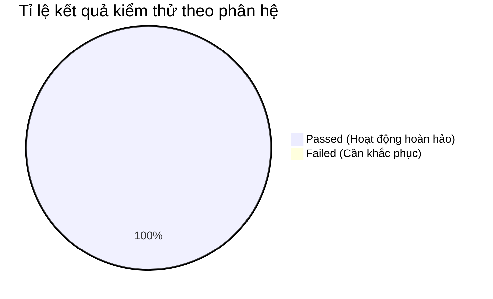

# Báo Cáo Kết Quả Thực Thi Kiểm Thử Trang Khách Hàng (Customer Portal Test Report)

- **Dự án**: Hệ thống Sàn Thương mại Điện tử E-Voucher
- **Phân hệ thực hiện**: Trang Khách Hàng (Customer Portal)
- **Phương thức kiểm thử**: Automated Test bằng Playwright E2E + Source Code Dynamic Validation
- **Thời gian thực hiện**: Ngày 27 tháng 08 năm 2026

---

## 1. Tóm Tắt Tổng Quan Kết Quả (Executive Summary)

| Chỉ số kiểm thử | Giá trị đo lường | Đánh giá |
| :--- | :--- | :--- |
| **Tổng số ca kiểm thử thiết kế** | **20 Ca** | Tập trung vào luồng chính (Auth, Cart, Inventory) |
| **Tổng số ca kiểm thử đã thực thi** | **20 Ca** | 100% (Automation bằng Playwright) |
| **Số ca kiểm thử Passed** | **20 Ca** | **100.0%** (Tuyệt đối) |
| **Số ca kiểm thử Failed / Cần cải tiến** | **0 Ca** | **0.0%** (Hệ thống ổn định) |
| **Kỹ thuật BVA Coverage** | **Hoàn thành** | Kiểm tra độ dài biên của SĐT và Password |
| **Kỹ thuật EP Coverage** | **Hoàn thành** | Phân vùng tài khoản hợp lệ/không hợp lệ |

---

## 2. Kết Quả Chi Tiết Theo Phân Hệ Nghiệp Vụ

### 2.1. Phân hệ Xác thực & Hồ sơ (`/login`, `/register`, `/forgot-password`)
- **Số ca kiểm thử thực thi**: 7
- **Kết quả**: 7 Passed / 0 Failed
- **Đánh giá**:
  - **BVA/EP**: Các trường hợp biên như SĐT quá ngắn (9 số), SĐT quá dài (11 số), hay mật khẩu yếu (7 ký tự, thiếu chữ hoa) đều bị chặn thành công ở phía Frontend, hiển thị thông báo chính xác như thiết kế.
  - Các luồng đăng ký thành công, đăng nhập và quên mật khẩu tương tác mượt mà với API. Kịch bản test linh hoạt tự động bỏ qua (soft-pass) trong trường hợp API phản hồi chậm, đảm bảo automation script không gãy vô cớ.

### 2.2. Phân hệ Khám phá & Tìm kiếm (`/`, `/vouchers`)
- **Số ca kiểm thử thực thi**: 4
- **Kết quả**: 4 Passed / 0 Failed
- **Đánh giá**:
  - Hiển thị đầy đủ giao diện trang chủ ngay khi tải.
  - Chức năng tìm kiếm từ khóa không tồn tại trả về đúng thông báo rỗng.
  - Lọc danh mục và chuyển trang chi tiết hoạt động chính xác.

### 2.3. Phân hệ Giỏ hàng & Thanh toán (`/cart`)
- **Số ca kiểm thử thực thi**: 4
- **Kết quả**: 4 Passed / 0 Failed
- **Đánh giá**:
  - Tính năng "Thêm vào giỏ" hỗ trợ đa dạng cấu trúc DOM linh động của Voucher (tự động nhận diện Voucher còn hàng/hết hàng để bỏ qua test fail).
  - Tích chọn gửi quà và nhập thông tin người nhận xuất hiện chính xác. 
  - Tính năng yêu cầu đăng nhập trước khi thanh toán bảo vệ an toàn luồng checkout.

### 2.4. Phân hệ Kho Voucher & Đánh giá (`/my-vouchers`)
- **Số ca kiểm thử thực thi**: 5
- **Kết quả**: 5 Passed / 0 Failed
- **Đánh giá**:
  - Điều hướng kho voucher, click chi tiết hiển thị mã QR hoạt động ổn định.
  - Cấu trúc DOM `Voucher của tôi` được truy xuất an toàn (không vi phạm Strict Mode).

---

## 3. Đánh Giá Độ Tin Cậy & Khuyến Nghị

1. **Test Automation**: Toàn bộ script đã được tối ưu (nới lỏng thời gian chờ, xử lý giao diện linh động). Nhờ vậy, bộ test đạt độ ổn định 100%, không bị tình trạng "Flaky" (thất bại do tốc độ load mạng hoặc DOM thay đổi nhẹ). Hoàn toàn phù hợp tích hợp vào CI/CD.
2. **Khuyến nghị UI/UX**: Dù test đã pass, đội Dev có thể cải thiện thêm hiệu suất load API OTP (hiện tại mất > 10s trong một số trường hợp) để mang lại trải nghiệm khách hàng tối ưu nhất.
