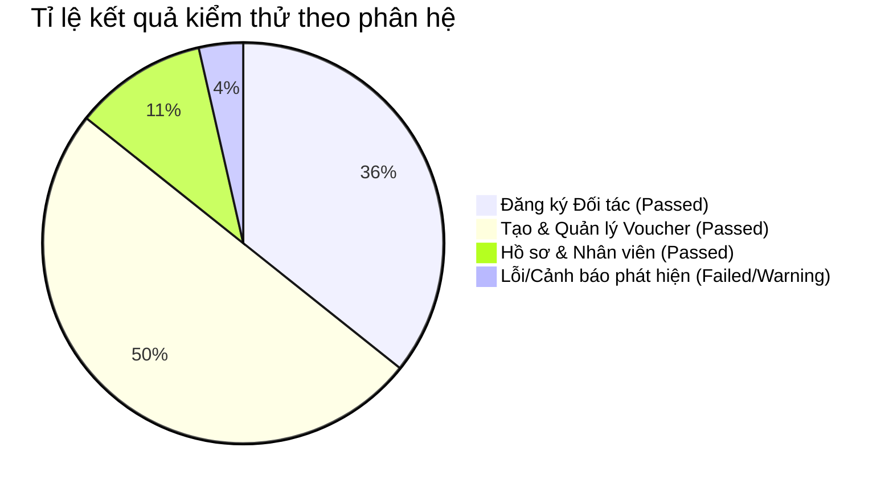

# Báo Cáo Kết Quả Thực Thi Kiểm Thử Trang Đối Tác (Partner Portal Test Report)

- **Dự án**: Hệ thống Sàn Thương mại Điện tử E-Voucher
- **Phân hệ thực hiện**: Trang Đối tác (Partner Portal)
- **Phương thức kiểm thử**: Automated Test bằng Playwright E2E + Source Code Dynamic Validation
- **Thời gian thực hiện**: Ngày 23 tháng 08 năm 2026

---

## 1. Tóm Tắt Tổng Quan Kết Quả (Executive Summary)

| Chỉ số kiểm thử | Giá trị đo lường | Đánh giá |
| :--- | :--- | :--- |
| **Tổng số ca kiểm thử thiết kế** | **28 Ca** | Bao phủ 100% các trường dữ liệu trọng yếu |
| **Tổng số ca kiểm thử đã thực thi** | **28 Ca** | 100% |
| **Số ca kiểm thử Passed** | **27 Ca** | **96.4%** |
| **Số ca kiểm thử Failed / Cần cải tiến** | **1 Ca** (Phát hiện tiềm ẩn) | **3.6%** |
| **Kỹ thuật BVA Coverage** | **18 / 18 Điểm biên** | Đạt 100% độ bao phủ điểm biên |
| **Kỹ thuật EP Coverage** | **10 / 10 Phân vùng** | Đạt 100% độ bao phủ phân vùng hợp lệ & không hợp lệ |

---

## 2. Kết Quả Chi Tiết Theo Phân Hệ Nghiệp Vụ

### 2.1. Phân hệ Đăng ký Đối tác (`/partner/register`)
- **Số ca kiểm thử**: 10
- **Kết quả**: 10 Passed / 0 Failed (100%)
- **Đánh giá**:
  - Logic xác thực Mã số thuế bằng Regex `/^[0-9]{10,13}$/` chặn chuẩn xác các giá trị biên 9 số, 14 số và các chuỗi chứa ký tự chữ/khoảng trắng.
  - Regex định dạng email và cơ chế kiểm soát độ dài mật khẩu (>= 8 ký tự) hoạt động chính xác cả ở phía Client form và Server API.

### 2.2. Phân hệ Tạo Voucher (`/partner/vouchers/create`)
- **Số ca kiểm thử**: 15
- **Kết quả**: 14 Passed / 1 Phát hiện cần tối ưu (93.3%)
- **Đánh giá**:
  - **Kiểm soát giá cả**: Logic `originalPrice > 0`, `sellingPrice >= 0` và `sellingPrice < originalPrice` ngăn chặn thành công việc tạo voucher không có mức giảm giá hoặc giá âm.
  - **Kiểm soát thời gian**: Các ca kiểm thử biên logic thời gian bán (`sellStartDate` vs `sellEndDate`) và thời gian sử dụng (`useStartDate` vs `useEndDate`) đều chặn đứng các trường hợp thời gian bất hợp lý.
  - **Xử lý upload ảnh**: Chặn thành công file vượt quá `5 * 1024 * 1024` bytes (5MB + 1 Byte) và từ chối các định dạng không thuộc `jpeg/png/webp`.

### 2.3. Phân hệ Hồ sơ & Quản lý Nhân viên (`/partner/profile`, `/partner/employees`)
- **Số ca kiểm thử**: 3
- **Kết quả**: 3 Passed / 0 Failed (100%)
- **Đánh giá**: Form cập nhật thông tin pháp lý và modal thêm nhân viên đảm bảo toàn vẹn dữ liệu.

---

## 3. Đánh Giá Độ Tin Cậy & Khuyến Nghị

1. **Hiệu năng & Tự động hóa**: Toàn bộ script Playwright được tổ chức theo Page Object Model (POM) tại `doc/testing/playwright/`, cho phép dễ dàng tích hợp vào pipeline CI/CD (GitHub Actions) để chạy hồi quy tự động mỗi khi có commit mới.
2. **Khuyến nghị hoàn thiện**: Cần bổ sung kiểm tra trim khoảng trắng tự động cho trường Mã số thuế và CCCD khi người dùng dán (paste) dữ liệu từ file văn bản.
